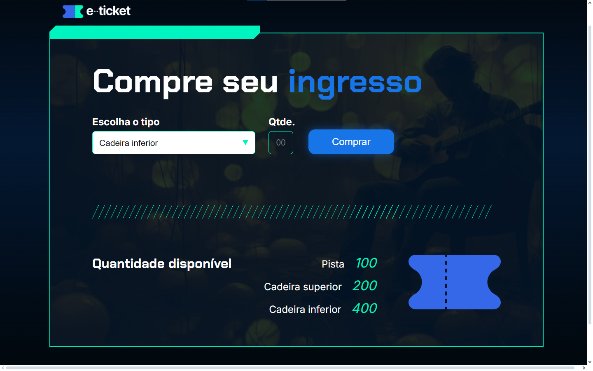

# Sistema de Compra de Ingressos

Este projeto simula a compra de ingressos em um site fictício. O usuário pode selecionar o tipo de ingresso, inserir a quantidade desejada e realizar a compra. O sistema atualiza automaticamente a quantidade disponível para cada tipo de ingresso e alerta caso a quantidade desejada exceda o estoque disponível.

## Demonstração



## Funcionalidades

- Seleção de tipo de ingresso (Pista, Cadeira Superior ou Cadeira Inferior).
- Validação da quantidade de ingressos disponíveis antes da compra.
- Atualização automática da quantidade de ingressos após a compra.
- Exibição de alertas caso a quantidade desejada exceda o estoque disponível.

## Tecnologias Utilizadas

- **HTML5**: Estrutura do conteúdo da página.
- **CSS3**: Estilização da interface para um design simples e intuitivo.
- **JavaScript**: Lógica para controle da compra de ingressos e atualização da disponibilidade.

## Como executar o projeto

1. Clone o repositório para sua máquina local:

    ```bash
    git clone (https://github.com/Leandro-Rocha81/Sistema-de-Compra-de-Ingressos.git)
    ```

2. Abra o arquivo `index.html` no navegador utilizando um servidor local.
3. Escolha o tipo e a quantidade de ingressos e clique no botão "Comprar" para realizar a compra.
4. A quantidade disponível será automaticamente atualizada, e alertas serão exibidos se houver erros na compra.

## Melhorias Futuras

- Implementar funcionalidade para reverter a compra (devolução de ingressos).
- Adicionar uma opção de login para personalizar a experiência do usuário.
- Incluir a função de exibir o resumo das compras realizadas.

## Contribuição

Contribuições são bem-vindas! Sinta-se à vontade para abrir uma *issue*, enviar um *pull request* com melhorias ou relatar problemas no repositório.

## Contato

Desenvolvido por Leandro Vitor Santos Rocha. Entre em contato em leandrocomercial81@gmail.com.
